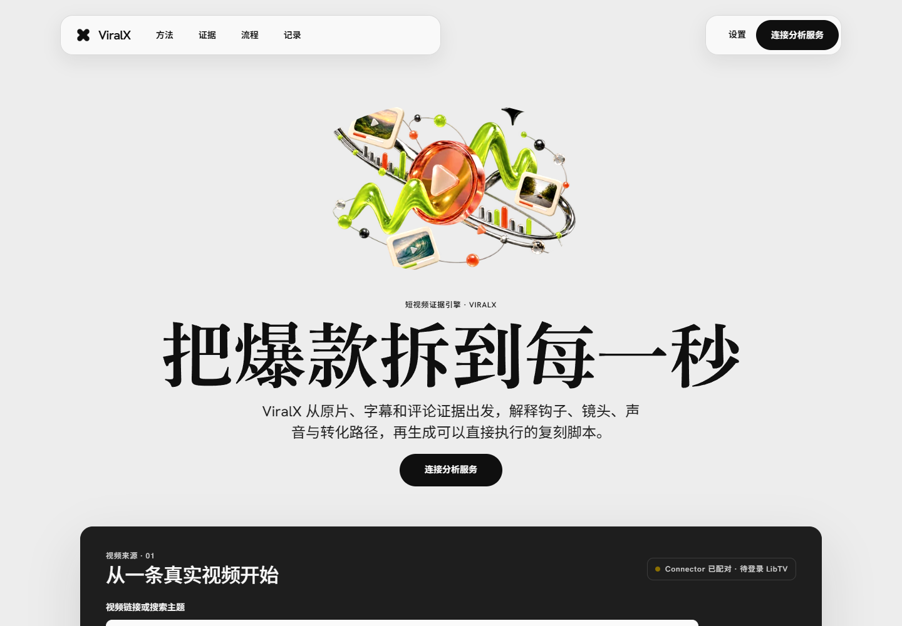
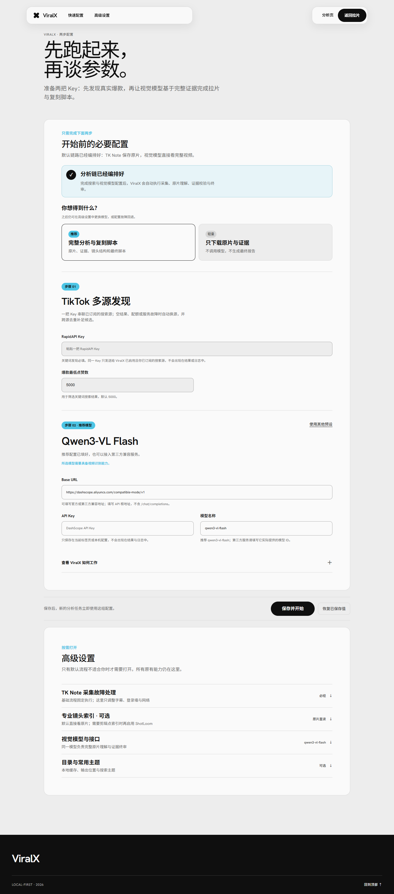
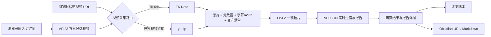

<p align="center">
  
</p>

<h1 align="center">ViralX</h1>

<p align="center">
  <strong>把爆款拆到每一秒。</strong><br>
  一个运行在浏览器里的短视频证据与拉片工作台。
</p>

<p align="center">
  <a href="https://viralx.metrolabs.mobi"></a>
  <a href="https://github.com/chongchonghaoman/ViralX/actions/workflows/ci.yml"></a>
  <a href=".agents/skills/viralx"></a>
  
  
  <a href="LICENSE"></a>
</p>

<p align="center">
  <a href="https://viralx.metrolabs.mobi">打开 ViralX</a> ·
  <a href="https://viralx.metrolabs.mobi/settings.html">网页设置</a> ·
  <a href="DESIGN.md">设计系统</a> ·
  <a href="DEPLOYMENT.md">部署说明</a>
</p>



## ViralX 是什么

ViralX 是一个完整的网页应用。它从真实的 TikTok / 抖音视频出发，把原片、元数据、字幕、转写与可选评论组织成证据包，再交给 LibTV 拆解钩子、镜头、声音、节奏和转化路径。分析结果通过网页实时返回，并可整理成复刻脚本或导出为 Markdown / Obsidian 笔记。

当前产品只有一种交付形态：**Web**。

- 生产环境运行在 EdgeOne Pages + Python Cloud Functions。
- 本地开发通过 Flask 提供同一套浏览器页面和 API。
- 产品只通过浏览器交付，不提供独立桌面应用。

## 在 Codex 中直接调用 ViralX

ViralX 同时作为一个可安装的 Codex Skill 发布。另一台电脑不需要安装桌面客户端，也不需要复制整个项目；把下面的 Skill 链接发给 Codex，让它安装即可：

```text
https://github.com/chongchonghaoman/ViralX/tree/main/.agents/skills/viralx
```

可以直接对 Codex 说：

```text
请从这个 GitHub 仓库安装 .agents/skills/viralx，然后使用 $viralx 分析视频：
https://github.com/chongchonghaoman/ViralX
```

也可以使用 Codex 内置的 `skill-installer`：

```bash
python ~/.codex/skills/.system/skill-installer/scripts/install-skill-from-github.py \
  --repo chongchonghaoman/ViralX \
  --path .agents/skills/viralx
```

Windows PowerShell：

```powershell
python "$env:USERPROFILE\.codex\skills\.system\skill-installer\scripts\install-skill-from-github.py" `
  --repo chongchonghaoman/ViralX `
  --path .agents/skills/viralx
```

安装后的下一轮对话即可调用：

```text
$viralx 分析这个 TikTok 视频：https://www.tiktok.com/@creator/video/123
$viralx 搜索 camping light，并分析点赞数高于 5000 的候选视频
```

Skill 默认调用线上 `https://viralx.metrolabs.mobi/api/*`，因此只需要 Python 3。凭据从目标电脑的环境变量读取，不要把 Key 发到聊天里：

```powershell
$env:LIBTV_ACCESS_KEY = "your-libtv-key"
$env:RAPIDAPI_KEY = "your-api23-key"  # 只有关键词搜索需要
```

仓库内的入口位于 [`.agents/skills/viralx`](.agents/skills/viralx)。如果直接克隆仓库并用 Codex 打开，根目录 `AGENTS.md` 也会把 ViralX 调用请求路由到同一个 Skill。

## 网页里现在能做什么

| 能力 | 网页中的实际行为 |
| --- | --- |
| API23 关键词搜索 | 输入搜索主题后，通过 RapidAPI TikTok API23 发现候选视频，支持游标分页、热度过滤和响应归一化 |
| 视频链接直达 | 粘贴 TikTok / 抖音链接时跳过 API23，直接进入视频采集与拉片链路 |
| TK Note 证据采集 | 保存原片、安全元数据、字幕 / ASR、资产清单和可选评论证据 |
| LibTV 一键拉片 | 上传视频、创建会话、轮询真实进度，并返回分析报告与项目画布 |
| 网页流式结果 | `/api/analyze` 使用 NDJSON 持续返回进度、结果、错误与恢复提示 |
| 产品复刻脚本 | 在首页填写产品名称和卖点，让分析结果转化为可执行的拍摄脚本 |
| 网页导出 | 在线生成 Obsidian URI 或下载 Markdown；不伪装拥有浏览器之外的文件权限 |
| 会话级 BYOK | API Key 只保存在当前标签页的 `sessionStorage`，关页自动清除 |

## 两个核心页面

### 1. 分析首页

首页同时承担产品说明和真实工作台：输入关键词或视频链接、查看运行状态、跟踪证据采集与拉片进度、打开报告、进入 LibTV 画布并导出结果。它不是营销演示页，页面中的“开始拉片”会调用真实同源 API。

页面地址：[viralx.metrolabs.mobi](https://viralx.metrolabs.mobi)

### 2. 网页设置

设置页集中管理 API23、TK Note、LibTV 和备用模型。在线环境只显示云端安全字段；本地目录、浏览器 Cookie、代理和持久缓存设置只在本地 Flask 开发运行时出现。



页面地址：[viralx.metrolabs.mobi/settings.html](https://viralx.metrolabs.mobi/settings.html)

## 工作逻辑



这里有一个重要边界：**API23 是搜索引擎，不是视频解析器。**

- 输入关键词：API23 负责找到候选 TikTok 视频。
- 粘贴链接：不需要 API23，由 TK Note / yt-dlp 采集视频资产。
- 开始拉片：默认交给 LibTV；Gemini、OpenRouter 等保留为兼容分析模式。

## Web 架构

```text
Browser
├── /                         分析首页
├── /settings.html            会话级 BYOK 设置
├── static/                   设计 token、页面样式、GSAP 动效与交互
└── /api/*                    同源请求
    └── EdgeOne Python Cloud Functions
        ├── API23             关键词发现
        ├── TK Note / yt-dlp  视频证据采集
        ├── LibTV             一键拉片
        └── Models            脚本和兼容分析
```

生产站和本地开发环境使用同一套页面、交互和 API 合同，区别只在后端运行边界：

| 运行位置 | 生产网站 | 本地 Web 开发 |
| --- | --- | --- |
| 浏览器 UI | 完整首页、设置页、报告与导出 | 同一套页面 |
| 后端 | EdgeOne Python Cloud Functions | Flask |
| 单次分析 | 最多 1 条视频 | 默认最多 5 条 |
| 凭据 | 当前标签页 BYOK 或项目环境变量 | `config.json` 或环境变量 |
| 临时文件 | `/tmp`，不承诺持久化 | 可使用本地持久目录 |
| Obsidian | URI 或 Markdown 下载 | 可直接写入本地 Vault |

## 在线使用

1. 打开 [ViralX](https://viralx.metrolabs.mobi)。
2. 前往[网页设置](https://viralx.metrolabs.mobi/settings.html)，填写本次需要使用的 API23、LibTV 或模型凭据。
3. 返回首页，输入关键词或粘贴单条视频链接。
4. 点击“开始拉片”，在页面中查看真实进度与结果。

公开站默认不内置第三方服务 Key。页面可以直接访问，但 API23 搜索、LibTV 拉片和模型调用只有在对应凭据已配置时才会运行。`/api/health` 只报告服务和凭据是否就绪，不会回显密钥，也不会把“网页在线”伪装成“第三方分析成功”。

## 本地 Web 开发

环境要求：Python 3.10+。只有构建或部署 EdgeOne 时才需要 Node.js 18+。

```bash
python -m pip install -r requirements.txt
```

创建配置：

```bash
cp config.json.example config.json
```

Windows PowerShell：

```powershell
Copy-Item config.json.example config.json
```

最小配置示例：

```json
{
  "analysis_mode": "libtv",
  "libtv_access_key": "YOUR_LIBTV_ACCESS_KEY",
  "rapidapi_key": "YOUR_API23_RAPIDAPI_KEY"
}
```

启动本地网页：

```bash
python web_app.py
```

浏览器访问 `http://localhost:5001`。本地运行仍然使用同一套 Web 界面。

## 服务配置

| 环境变量 / 设置项 | 用途 | 是否必需 |
| --- | --- | --- |
| `RAPIDAPI_KEY` / `rapidapi_key` | API23 关键词搜索 | 仅搜索关键词时需要 |
| `LIBTV_ACCESS_KEY` / `libtv_access_key` | 默认的一键拉片分析 | 使用 LibTV 时需要 |
| `MINIMAX_API_KEY` / `minimax_api_key` | 脚本生成与变体 API | 可选 |
| `GEMINI_API_KEY` / `gemini_api_key` | Gemini 兼容分析模式 | 可选 |
| `OPENROUTER_API_KEY` / `openrouter_api_key` | OpenRouter 兼容分析模式 | 可选 |

直接粘贴 TikTok 视频链接时不会调用 API23。完整字段、超时、ASR、代理和本地缓存配置见 [`config.json.example`](config.json.example)。

## Web API

| 端点 | 方法 | 说明 |
| --- | --- | --- |
| `/api/health` | GET | 返回运行时、分析提供方和无密钥值的就绪状态 |
| `/api/keywords` | GET | 获取常用主题或已有分析主题 |
| `/api/analyze` | POST | NDJSON 流式视频分析 |
| `/api/generate_variants` | POST | 生成脚本变体的扩展 API |
| `/api/export-obsidian` | POST | 生成 Obsidian URI 或 Markdown 下载 |

`/api/settings` 和 `/api/cache/clear` 只属于本地 Flask 开发运行时，不会公开到 EdgeOne。

## 设计与动效

- 视觉：亮色产品编辑界面，深色分析工作台；页面内容和功能属于 ViralX。
- 字体：Hanken Grotesk + Noto Sans SC。
- 色彩：由 `static/tokens.css` 统一管理。
- 动效：GSAP 3.13 + ScrollTrigger，绑定首屏、阅读顺序和真实分析状态。
- 降级：支持 `prefers-reduced-motion`，关闭空间位移动效后仍可完整操作。
- 响应式：桌面端与移动端保持同一任务顺序。

完整约束见 [DESIGN.md](DESIGN.md)。

## 项目结构

```text
ViralX/
├── .agents/skills/viralx/          Codex 可安装、可直接调用的 ViralX Skill
├── AGENTS.md                       仓库级 Codex 调用入口
├── templates/
│   ├── index.html                 网页分析首页
│   └── settings.html              网页设置页
├── static/
│   ├── tokens.css                 共享设计 token
│   ├── viralx.css / viralx.js     首页、报告与 GSAP 交互
│   ├── settings.css / settings.js 设置页
│   └── assets/                    品牌和主视觉资产
├── cloud-functions/
│   └── api/[[default]].py         EdgeOne 公网 API
├── scripts/build-edgeone.mjs      网页与云函数构建
├── tiktok_viral_analyzer.py       API23 搜索与响应归一化
├── video_ingest.py                TK Note / yt-dlp 采集路由
├── libtv_analyzer.py              LibTV 上传、会话和轮询
├── ai_analyzer.py                 分析编排
├── web_app.py                     本地 Web 开发服务器
├── tests/                          网页、API、采集与分析测试
├── DESIGN.md                      视觉与交互合同
└── DEPLOYMENT.md                  EdgeOne、DNS 与运行边界
```

## 测试与构建

```bash
python -m unittest discover -s tests -v
npm run build:edgeone
```

当前测试集共 26 项，覆盖 ViralX Skill 客户端、API23、TK Note、LibTV、本地 Flask、EdgeOne BYOK、公私路由边界和浏览器版 Obsidian 导出。GitHub Actions 使用 Python 3.10、3.11、3.12 运行后端测试，并验证 EdgeOne 网页构建。

## EdgeOne 部署

```bash
npm run build:edgeone
npm run preview:edgeone
npm run deploy:edgeone
```

生产域名是 [viralx.metrolabs.mobi](https://viralx.metrolabs.mobi)。构建产物写入已忽略的 `public/`；构建过程只复制网页、公开云函数和必要的后端模块，不复制 `config.json`。详细记录见 [DEPLOYMENT.md](DEPLOYMENT.md)。

## License

[MIT](LICENSE)。第三方组件与相关许可见 [THIRD_PARTY_NOTICES.md](THIRD_PARTY_NOTICES.md)。
