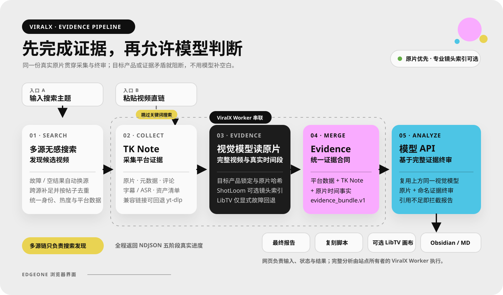

<p align="center">
  
</p>

<h1 align="center">ViralX</h1>

<p align="center">
  <strong>把爆款拆到每一秒。</strong><br>
  一个运行在浏览器里的短视频证据与拉片工作台。
</p>

<p align="center">
  <a href="https://viralx.metrolabs.mobi"></a>
  <a href="https://github.com/chongchonghaoman/ViralX/actions/workflows/ci.yml"></a>
  <a href=".agents/skills/viralx"></a>
  
  
  <a href="LICENSE"></a>
</p>

<p align="center">
  <a href="https://viralx.metrolabs.mobi">打开 ViralX</a> ·
  <a href="https://viralx.metrolabs.mobi/settings.html">网页设置</a> ·
  <a href="DESIGN.md">设计系统</a> ·
  <a href="DEPLOYMENT.md">部署说明</a>
</p>

<p align="center"><sub>最后更新：2026-08-26 · 当前版本：Web 产品 + EdgeOne Cloud Functions + 本机 LibTV Connector</sub></p>


## ViralX 是什么

ViralX 是一个证据优先的短视频拆解网页应用。它执行一条固定的串联链：**API23 发现候选视频（直链跳过）→ TK Note 下载原片并采集平台证据 → LibTV 对原视频逐镜拉片 → 合并两份证据 → 用户选择的模型 API 完成最终分析与复刻脚本**。EdgeOne 提供网页界面，本机 Connector 承担需要本地 Python、文件缓存和 LibTV CLI 登录态的完整流水线。

当前产品只有一种交付形态：**Web**。

- 生产环境运行在 EdgeOne Pages + Python Cloud Functions。
- 本地开发通过 Flask 提供同一套浏览器页面和 API。
- 产品只通过浏览器交付，不提供独立桌面应用。
- Connector 是一个最小化的本机安全桥接进程，不是第二套客户端或桌面界面。

## 2026 Web 重构更新

这次不是给旧客户端换皮，而是把 ViralX 重新做成了可以直接打开、配置和运行的网页产品：

- **产品形态全面 Web 化**：首页承担真实分析工作台，设置页管理流水线依赖与凭据；桌面端和移动端共享同一条任务链。
- **分析逻辑改为固定串联**：移除“LibTV 或模型 API”的二选一。TK Note 证据和 LibTV 拉片证据现在会先合并，再交给模型 API 做最终综合判断。
- **重新建立视觉系统**：采用 Butter 式的中性画布、双悬浮导航、单一主视觉和深色分析台；首页标题使用用户选定的 DNP 秀英明朝轮廓作品，并保留语义 H1，不在仓库中分发字体文件。
- **线上页面不伪装云端能力**：EdgeOne Pages 提供同源健康检查、会话设置和浏览器安全导出；完整分析明确路由到本机 Connector，不把无法读取本机 CLI 登录态的云函数冒充为可运行流水线。
- **搜索链路切换为 API23**：按官方 `/api/search/video` → `/api/search/general` → `/api/post/discover` 串行发现候选，前一入口空结果或临时不可用（含 HTTP 200 内的业务状态 4）才进入下一入口；支持分页、热度过滤、混合 Top 响应归一化、逐入口诊断和凭据脱敏。备用入口失败不再覆盖主入口已经正常返回的空结果或点赞过滤信息。API23 只负责关键词发现，粘贴视频链接时会直接跳过搜索。
- **TK Note 共享本地 ASR**：自动复用 `%USERPROFILE%\.cache\rimagination-notes` 中已有的 Whisper 或 Qwen3-ASR Python 环境；也可通过环境变量明确指定解释器。Connector 使用哪个 Python 启动都不会因此丢失已有 ASR 能力。
- **LibTV 从“上传交接”升级为真实拉片**：Connector 会创建画布、上传 TK Note 原片，再创建绑定 `GVLM 3.1 Flash` 的多模态文本节点并运行；镜头、钩子、节奏、声音、转场和转化节点会作为结构化证据返回。
- **Connector 承担完整编排**：浏览器与 `127.0.0.1` 完成一次性配对后，把 API23、TK Note 与模型会话配置交给 Connector。模型 Key 只到本机 Connector，再由它直连所选服务商；不经过、不落盘到 EdgeOne，也不会写入日志。
- **模型 API 设置重构**：设置页改为 OpenAI、Claude、Gemini、DeepSeek、OpenRouter 五个常用预设和自定义 API；统一填写 Key、模型名、Base URL 与协议，不再维护三套割裂字段。
- **新增 Codex Agent 调用入口**：仓库自带可安装的 ViralX Skill，另一台电脑上的 Codex 可以通过 GitHub 链接直接安装并调用线上 API。
- **重画云端与本地边界**：EdgeOne 云函数不能读取本机文件或 LibTV 登录态；浏览器只在用户授权后连接 `127.0.0.1:57231`。Connector 不暴露本地设置、清缓存或任意文件系统能力。
- **把“在线”和“可分析”分开**：只有 Connector 已配对、LibTV 已登录且模型 API 已配置时，首页才显示完整链路就绪；缺少任一项都会进入设置页。
- **五阶段真实进度**：首页不再用百分比猜阶段，而是消费后端 NDJSON 事件，分别显示发现视频、TK Note 采集、LibTV 拉片、证据合并和模型终审。
- **设置页改成真实连接状态机**：LibTV 区明确区分未检测到 Connector、等待配对、未连接、启动中、等待网页授权、已连接、需安装 CLI 与错误；模型字段错误仍会落到对应控件并自动聚焦。
- **报告渲染加固**：Marked 固定到明确版本并启用 SRI；模型和 LibTV 返回的 Markdown 在进入弹层前经过标签、属性和链接协议允许列表净化。
- **首屏资源瘦身**：主视觉增加 640 / 1024 WebP 响应式资源，浏览器按视口选择约 58 KB 或 119 KB 文件，同时保留原 PNG 回退。

下面的依赖表、调用方式、页面说明和部署章节均以这一版 Web 架构为准。

## 现在到底需要哪些 API

ViralX 现在只有一条主链：**TK Note + LibTV + 模型 API**。它们不是替代关系；LibTV 提供新增的视听证据，最终模型负责把平台证据和拉片证据放在同一个上下文中完成判断。MiniMax 不参与默认分析流程。

| 你要做的事 | 实际调用 | 需要的凭据 |
| --- | --- | --- |
| 网页粘贴视频链接并分析 | 浏览器 → Connector → TK Note → LibTV 拉片 → 证据合并 → 模型 API | Connector + LibTV 网页登录 + `MODEL_API_KEY` |
| 网页输入关键词并分析 | API23 → Connector → TK Note → LibTV 拉片 → 证据合并 → 模型 API | 上述配置 + `RAPIDAPI_KEY` |
| 调用旧版脚本变体扩展接口 | MiniMax | 可选的 `MINIMAX_API_KEY` |

因此：**RapidAPI 只用于 API23 关键词搜索，直链分析不需要它。LibTV 不接受 Access Key，只认官方 CLI 的本机网页登录；ViralX 不读取 CLI token。模型 API 是最终分析阶段的必需项。MiniMax 只是兼容保留项。**

## 在 Codex 中直接调用 ViralX

ViralX 同时作为一个可安装的 Codex Skill 发布。另一台电脑不需要安装桌面客户端，也不需要复制整个项目；把下面的 Skill 链接发给 Codex，让它安装即可：

```text
https://github.com/chongchonghaoman/ViralX/tree/main/.agents/skills/viralx
```

可以直接对 Codex 说：

```text
请从这个 GitHub 仓库安装 .agents/skills/viralx，然后使用 $viralx 分析视频：
https://github.com/chongchonghaoman/ViralX
```

也可以使用 Codex 内置的 `skill-installer`：

```bash
python ~/.codex/skills/.system/skill-installer/scripts/install-skill-from-github.py \
  --repo chongchonghaoman/ViralX \
  --path .agents/skills/viralx
```

Windows PowerShell：

```powershell
python "$env:USERPROFILE\.codex\skills\.system\skill-installer\scripts\install-skill-from-github.py" `
  --repo chongchonghaoman/ViralX `
  --path .agents/skills/viralx
```

安装后的下一轮对话即可调用：

```text
$viralx 分析这个 TikTok 视频：https://www.tiktok.com/@creator/video/123
$viralx 搜索 camping light，并分析点赞数高于 5000 的候选视频
```

Skill 可以直接安装并读取 ViralX 的 API 合同。完整分析需要目标电脑运行本地 Flask（或由浏览器配对的 Connector）并完成 LibTV 网页登录；EdgeOne 本身不会伪装拥有这台电脑的原片与 CLI 登录态。让 Codex 调用本地 Flask 时，凭据从目标电脑环境或 `config.json` 读取，不要把 Key 发到聊天里：

```powershell
$env:RAPIDAPI_KEY = "your-api23-key"  # 只有关键词搜索需要
$env:ANALYSIS_MODE = "pipeline"
$env:MODEL_PROVIDER = "openai"
$env:MODEL_API_KEY = "your-model-key"
$env:MODEL_NAME = "gpt-4.1-mini"
```

运行 `python web_app.py`、在 `/settings` 点击“连接 LibTV”，再设置 `$env:VIRALX_BASE_URL = "http://127.0.0.1:5001"`。Connector 的短期浏览器会话不会替代 Agent 的本地 API 地址，也不会把 LibTV 登录凭据发送给 EdgeOne。

仓库内的入口位于 [`.agents/skills/viralx`](.agents/skills/viralx)。如果直接克隆仓库并用 Codex 打开，根目录 `AGENTS.md` 也会把 ViralX 调用请求路由到同一个 Skill。

## 网页里现在能做什么

| 能力 | 网页中的实际行为 |
| --- | --- |
| API23 关键词搜索 | 输入搜索主题后，通过 RapidAPI TikTok API23 发现候选视频；支持 Search Video、Search General、Discover 三个官方入口、分页、热度过滤、响应归一化和逐入口空结果诊断 |
| 视频链接直达 | 粘贴 TikTok / 抖音链接时跳过 API23，直接进入视频采集与拉片链路 |
| TK Note 证据采集 | 保存原片、安全元数据、字幕 / ASR、资产清单和可选评论证据；自动发现共享 Whisper / Qwen3-ASR 环境 |
| LibTV 网页连接 | EdgeOne 页面与本机 Connector 一次性配对，再调用官方 `libtv login web`；连接后创建画布、上传原视频、运行多模态拉片节点并返回证据与画布入口 |
| 证据合并与模型终审 | 将平台数据、评论、字幕/ASR、TK Note 资产状态和 LibTV 拉片证据统一交给所选模型生成最终报告 |
| 网页流式结果 | `/api/analyze` 使用 NDJSON 持续返回进度、结果、错误与恢复提示 |
| 产品复刻脚本 | 在首页填写产品名称和卖点，让分析结果转化为可执行的拍摄脚本 |
| 网页导出 | 在线生成 Obsidian URI 或下载 Markdown；不伪装拥有浏览器之外的文件权限 |
| 会话级 BYOK | API Key 只保存在当前标签页的 `sessionStorage`，关页自动清除 |

## 两个核心页面

### 1. 分析首页

首页同时承担产品说明和真实工作台：输入关键词或视频链接、查看完整链路就绪状态、跟踪五个真实阶段、打开最终报告、进入 LibTV 画布并导出结果。它不是营销演示页。

页面地址：[viralx.metrolabs.mobi](https://viralx.metrolabs.mobi)

### 2. 网页设置

设置页按固定链路集中管理 API23、TK Note、LibTV 和最终模型 API，不再提供分析模式选择。EdgeOne 会主动检测本机 Connector，并展示“未启动、等待配对、待登录、等待网页授权、已连接”等真实状态。模型区提供 OpenAI、Claude、Gemini、DeepSeek、OpenRouter 常用预设，也支持自定义 OpenAI Chat Completions / Anthropic Messages 兼容接口。


页面地址：[viralx.metrolabs.mobi/settings.html](https://viralx.metrolabs.mobi/settings.html)

## 工作逻辑



流程图的可维护源码见 [`docs/assets/viralx-workflow.mmd`](docs/assets/viralx-workflow.mmd)。

ViralX 不是“任选一个工具来分析”，而是一条**固定串联的证据链**：

| 阶段 | 负责什么 | 交给下一阶段的内容 |
| --- | --- | --- |
| 01 · API23 | 仅在输入关键词时搜索候选 TikTok 视频 | 视频 URL、热度与基础平台数据 |
| 02 · TK Note / yt-dlp | 下载原片并采集平台侧证据 | 原片、元数据、评论、字幕 / ASR、资产清单 |
| 03 · LibTV | 创建画布、上传原片并运行多模态拉片节点 | 镜头、画面、声音和时间线证据，以及画布入口 |
| 04 · Evidence Merge | 合并平台、TK Note 与 LibTV 证据 | 统一的 `viralx.evidence.v1` 证据合同 |
| 05 · Model API | 使用设置页选定的模型，基于完整证据终审 | 最终报告、复刻脚本和可导出结果 |

这里有三个重要边界：

- **API23 是搜索引擎，不是视频解析器。** 输入关键词时调用 API23；粘贴视频直链时直接从 TK Note / yt-dlp 开始。
- **LibTV 不是搜索或下载工具。** 它接收 TK Note 已保存的原片，专门完成多模态拉片，并把新增证据送入合并阶段。
- **EdgeOne 是浏览器界面，不是本机分析运行时。** 页面负责输入、设置、状态和结果；完整链路由已配对的本机 Connector 串联执行。Connector、LibTV 登录和模型 API 都就绪后才会运行，不会把“网页在线”伪装成“完整链路就绪”。

## Web 架构

```text
Browser
├── /                         分析首页
├── /settings.html            会话级 BYOK 设置
├── static/                   设计 token、页面样式、GSAP 动效与交互
├── /api/*                    EdgeOne 健康检查、主题与浏览器导出
└── http://127.0.0.1:57231    完整分析：受限 Connector API
    ├── TK Note / yt-dlp      原片与平台证据
    ├── official libtv CLI    网页登录、画布、上传、拉片节点
    └── selected model API    合并证据后的最终分析
```

生产站和本地开发环境使用同一套页面、交互和 API 合同，区别只在后端运行边界：

| 运行位置 | 生产网站 | 本地 Web 开发 |
| --- | --- | --- |
| 浏览器 UI | 完整首页、设置页、报告与导出 | 同一套页面 |
| 后端 | EdgeOne 界面 + 本机 Connector | Flask |
| 单次分析 | Connector 限制 1 条视频 | 默认最多 5 条 |
| 凭据 | 当前标签页 BYOK 或项目环境变量 | `config.json` 或环境变量 |
| 临时文件 | `/tmp`，不承诺持久化 | 可使用本地持久目录 |
| Obsidian | URI 或 Markdown 下载 | 可直接写入本地 Vault |
| LibTV | 通过本机 Connector使用官方 CLI 拉片节点 | 官方 CLI 网页登录、画布与拉片节点 |

## 在线使用

1. 打开 [ViralX](https://viralx.metrolabs.mobi)。
2. 启动本机 Connector，前往[网页设置](https://viralx.metrolabs.mobi/settings.html)完成 LibTV 网页登录并选择最终模型；关键词搜索时再填写 API23。
3. 返回首页，输入关键词或粘贴单条视频链接。
4. 点击“开始拉片”，在页面中查看真实进度与结果。

公开站默认不内置第三方服务 Key。模型凭据只保存在当前标签页；LibTV 凭据只由官方 CLI 保存。`/api/health` 与 Connector 状态都不回显密钥，也不会把“网页在线”伪装成“分析已就绪”。

## 在网页使用本机 LibTV

这是生产网页使用 LibTV 的推荐路径，仍然只打开 [viralx.metrolabs.mobi](https://viralx.metrolabs.mobi)：

1. 在需要运行 TK Note / LibTV 的电脑克隆本仓库并安装依赖。
2. 双击 `start-connector.cmd`，或在仓库目录执行 `python connector.py`。
3. Connector 只监听 `127.0.0.1:57231`，随后自动打开 ViralX 设置页；浏览器可能询问是否允许访问本机网络，请选择允许。
4. 页面会消费 URL fragment 中的一次性密钥，换取只存在当前标签页和 Connector 内存里的 12 小时会话，并立刻从地址栏删除 fragment。
5. 点击“连接 LibTV”，在 LibTV 官方网页完成授权。返回 ViralX 后状态会自动刷新；开始分析时，Connector 依次运行 TK Note、LibTV 拉片、证据合并和模型终审。

```bash
python -m pip install -r requirements.txt
python connector.py
```

安全边界：Connector 精确允许 `https://viralx.metrolabs.mobi`，拒绝其他 Origin；它不提供 `/api/settings`、`/api/cache/clear`、本地 Obsidian 文件写入或任意代理能力。会话级模型 Key 只从当前标签页发送到已配对的 loopback Connector，再直连所选模型服务，不经过 EdgeOne。关闭 Connector 即断开网页与本机运行时；关闭标签页会清除浏览器会话。Chrome 142+ 会针对公网网页访问 loopback 显示 [Local Network Access](https://developer.chrome.com/blog/local-network-access) 权限提示，这是预期的浏览器保护机制。

## 本地 Web 开发

环境要求：Python 3.10+。使用 LibTV 时还需安装[官方 LibTV CLI](https://www.liblib.tv/cli)；只有构建或部署 EdgeOne 时才需要 Node.js 18+。

```bash
python -m pip install -r requirements.txt
```

创建配置：

```bash
cp config.json.example config.json
```

Windows PowerShell：

```powershell
Copy-Item config.json.example config.json
```

最小配置示例：

```json
{
  "analysis_mode": "pipeline",
  "model_provider": "openai",
  "model_api_key": "YOUR_MODEL_API_KEY",
  "model_name": "gpt-4.1-mini",
  "rapidapi_key": "YOUR_API23_RAPIDAPI_KEY_FOR_SEARCH"
}
```

启动本地网页：

```bash
python web_app.py
```

浏览器访问 `http://localhost:5001`，进入 `/settings` 点击“连接 LibTV”。ViralX 会启动 `libtv login web` 并打开官方授权页；官方 CLI 将登录状态保存在自己的本机目录，ViralX 只通过 `libtv account info` 判断是否已连接。

## 服务配置

| 环境变量 / 设置项 | 用途 | 是否必需 |
| --- | --- | --- |
| `RAPIDAPI_KEY` / `rapidapi_key` | API23 关键词搜索 | 仅搜索关键词时需要 |
| `LIBTV_CLI_BINARY` | 官方 `libtv` 可执行文件路径；通常可自动发现 | 仅自动发现失败时填写 |
| `RIMAGINATION_NOTE_CACHE` | TK Note 共享下载与 ASR 缓存目录；默认 `%USERPROFILE%\.cache\rimagination-notes` | 可选 |
| `RIMAGINATION_QWEN_PYTHON` | 明确指定已安装 Qwen3-ASR 的 Python 解释器 | 仅自动发现失败时填写 |
| `RIMAGINATION_WHISPER_PYTHON` | 明确指定已安装 OpenAI Whisper 的 Python 解释器 | 仅自动发现失败时填写 |
| `MODEL_PROVIDER` / `model_provider` | `openai`、`anthropic`、`gemini`、`deepseek`、`openrouter`、`custom` | 完整分析必需 |
| `MODEL_API_KEY` / `model_api_key` | 当前服务商的 API Key | 完整分析必需 |
| `MODEL_NAME` / `model_name` | 当前账户可调用的完整模型 ID | 完整分析必需 |
| `MODEL_BASE_URL` / `model_base_url` | 自定义 API 根地址；常用预设自动填写 | 自定义服务商时需要 |
| `MODEL_PROTOCOL` / `model_protocol` | `openai` 或 `anthropic` | 自定义服务商时需要 |
| `MINIMAX_API_KEY` / `minimax_api_key` | 仅旧版 `/api/generate_variants` 脚本变体扩展 | 可选；网页默认主链不调用 |

旧版 `GEMINI_*`、`OPENROUTER_*`、`MINIMAX_*` 分析配置会在读取时迁移到统一模型合同，避免已有本地配置突然失效。MiniMax 的旧版脚本变体接口仍独立保留。

直接粘贴 TikTok 视频链接时不会调用 API23。完整字段、超时、ASR、代理和本地缓存配置见 [`config.json.example`](config.json.example)。

## Web API

| 端点 | 方法 | 说明 |
| --- | --- | --- |
| `/api/health` | GET | 返回运行时、分析提供方和无密钥值的就绪状态 |
| `/api/keywords` | GET | 获取常用主题或已有分析主题 |
| `/api/analyze` | POST | NDJSON 流式视频分析 |
| `/api/generate_variants` | POST | 生成脚本变体的扩展 API |
| `/api/export-obsidian` | POST | 生成 Obsidian URI 或 Markdown 下载 |
| `/api/libtv/auth/status` | GET | 本地：读取无凭据值的 CLI 连接状态 |
| `/api/libtv/auth/start` | POST | 本地：启动官方 `libtv login web` |
| `/api/libtv/auth/logout` | POST | 本地：断开官方 CLI 登录 |

Connector 只监听 `127.0.0.1:57231`，使用独立的 `/connector/v1/*` 路径：`status`、一次性 `pair`、LibTV `status/login/logout` 与单视频 `analyze`。除探活和配对外均要求 `X-ViralX-Connector-Token`；令牌只存内存和当前标签页。

`/api/settings`、`/api/cache/clear` 和 `/api/libtv/auth/*` 只属于本地 Flask，不公开到 EdgeOne。

## 设计与动效

- 视觉：亮色产品编辑界面，深色分析工作台；页面内容和功能属于 ViralX。
- 字体：Hanken Grotesk + Noto Sans SC。
- 色彩：由 `static/tokens.css` 统一管理。
- 动效：GSAP 3.13 + ScrollTrigger，绑定首屏、阅读顺序和真实分析状态。
- 降级：支持 `prefers-reduced-motion`，关闭空间位移动效后仍可完整操作。
- 响应式：桌面端与移动端保持同一任务顺序。

完整约束见 [DESIGN.md](DESIGN.md)。

## 项目结构

```text
ViralX/
├── .agents/skills/viralx/          Codex 可安装、可直接调用的 ViralX Skill
├── AGENTS.md                       仓库级 Codex 调用入口
├── templates/
│   ├── index.html                 网页分析首页
│   └── settings.html              网页设置页
├── static/
│   ├── tokens.css                 共享设计 token
│   ├── viralx.css / viralx.js     首页、报告与 GSAP 交互
│   ├── settings.css / settings.js 设置页
│   ├── connector.js               网页与本机 Connector 的配对和请求路由
│   └── assets/                    品牌和主视觉资产
├── cloud-functions/
│   └── api/[[default]].py         EdgeOne 公网 API
├── scripts/build-edgeone.mjs      网页与云函数构建
├── tiktok_viral_analyzer.py       API23 搜索与响应归一化
├── video_ingest.py                TK Note / yt-dlp 采集路由
├── libtv_analyzer.py              官方 CLI 网页登录、画布、视频上传与多模态拉片
├── local_connector.py             loopback-only 安全 API 与配对会话
├── connector.py                   Connector 启动入口
├── start-connector.cmd            Windows 双击启动入口
├── ai_analyzer.py                 分析编排
├── web_app.py                     本地 Web 开发服务器
├── tests/                          网页、API、采集与分析测试
├── DESIGN.md                      视觉与交互合同
└── DEPLOYMENT.md                  EdgeOne、DNS 与运行边界
```

## 测试与构建

```bash
python -m unittest discover -s tests -v
npm run build:edgeone
```

当前测试集覆盖 ViralX Skill 调用脚本、API23 Search Video / Search General / Discover 三入口、业务状态 4 自动回退、空结果不被备用错误覆盖与凭据脱敏、TK Note 共享 Whisper 环境发现与执行、TK Note → LibTV → 模型串联证据合同、LibTV 多模态节点、本地 Flask、EdgeOne 运行边界、浏览器版 Obsidian 导出，以及 Connector 的 Origin/PNA 预检、一次性配对、防重放、鉴权、模型会话头与前端五阶段合同。GitHub Actions 使用 Python 3.10、3.11、3.12 运行后端测试，并验证 EdgeOne 网页构建。

## EdgeOne 部署

```bash
npm run build:edgeone
npm run preview:edgeone
npm run deploy:edgeone
```

生产域名是 [viralx.metrolabs.mobi](https://viralx.metrolabs.mobi)。构建产物写入已忽略的 `public/`；构建过程只复制网页、公开云函数和必要的后端模块，不复制 `config.json`。详细记录见 [DEPLOYMENT.md](DEPLOYMENT.md)。

## License

[MIT](LICENSE)。第三方组件与相关许可见 [THIRD_PARTY_NOTICES.md](THIRD_PARTY_NOTICES.md)。
