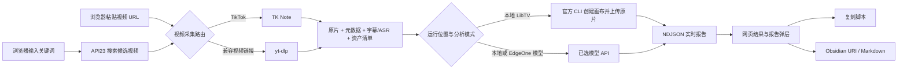

<p align="center">
  
</p>

<h1 align="center">ViralX</h1>

<p align="center">
  <strong>把爆款拆到每一秒。</strong><br>
  一个运行在浏览器里的短视频证据与拉片工作台。
</p>

<p align="center">
  <a href="https://viralx.metrolabs.mobi"></a>
  <a href="https://github.com/chongchonghaoman/ViralX/actions/workflows/ci.yml"></a>
  <a href=".agents/skills/viralx"></a>
  
  
  <a href="LICENSE"></a>
</p>

<p align="center">
  <a href="https://viralx.metrolabs.mobi">打开 ViralX</a> ·
  <a href="https://viralx.metrolabs.mobi/settings.html">网页设置</a> ·
  <a href="DESIGN.md">设计系统</a> ·
  <a href="DEPLOYMENT.md">部署说明</a>
</p>

<p align="center"><sub>最后更新：2026-08-25 · 当前版本：Web 产品 + EdgeOne Python Cloud Functions</sub></p>


## ViralX 是什么

ViralX 是一个完整的网页应用。它从真实的 TikTok / 抖音视频出发，把原片、元数据、字幕、转写与可选评论组织成证据包。本地版可通过官方 LibTV CLI 网页登录，把原片上传到新建画布继续逐帧拉片；EdgeOne 网页端则调用你选择的模型 API。结果通过网页实时返回，并可整理成复刻脚本或导出为 Markdown / Obsidian 笔记。

当前产品只有一种交付形态：**Web**。

- 生产环境运行在 EdgeOne Pages + Python Cloud Functions。
- 本地开发通过 Flask 提供同一套浏览器页面和 API。
- 产品只通过浏览器交付，不提供独立桌面应用。

## 2026 Web 重构更新

这次不是给旧客户端换皮，而是把 ViralX 重新做成了可以直接打开、配置和运行的网页产品：

- **产品形态全面 Web 化**：首页承担真实分析工作台，设置页管理运行模式与凭据；桌面端和移动端共享同一条任务链。
- **重新建立视觉系统**：采用 Butter 式的中性画布、双悬浮导航、单一主视觉和深色分析台；首页标题使用用户选定的 DNP 秀英明朝轮廓作品，并保留语义 H1，不在仓库中分发字体文件。
- **线上功能不再是假演示**：EdgeOne Pages 搭配 Python Cloud Functions，支持同源健康检查、API23 搜索、单视频分析、流式进度和浏览器安全导出。
- **搜索链路切换为 API23**：适配 API23 的请求参数、分页游标与多种响应结构；API23 只负责关键词发现，粘贴视频链接时会直接跳过搜索。
- **LibTV 改用官方网页登录**：彻底移除旧 Access Key、Agent-IM 会话脚本和轮询参数；本地设置页启动官方 `libtv login web`，授权成功后创建画布并上传 TK Note 采集的原片。
- **模型 API 设置重构**：设置页改为 OpenAI、Claude、Gemini、DeepSeek、OpenRouter 五个常用预设和自定义 API；统一填写 Key、模型名、Base URL 与协议，不再维护三套割裂字段。
- **新增 Codex Agent 调用入口**：仓库自带可安装的 ViralX Skill，另一台电脑上的 Codex 可以通过 GitHub 链接直接安装并调用线上 API。
- **明确云端与本地边界**：EdgeOne 不可能访问访客电脑上的 LibTV CLI 登录态，因此线上只开放模型 API 分析；本地 Flask 提供 LibTV、持久缓存、目录访问、浏览器 Cookie、代理与 Obsidian 文件写入。
- **把“在线”和“可分析”分开**：首页读取健康状态；未连接 LibTV 或模型 API 时，主按钮会直接进入设置，不会把公开页面在线伪装成分析服务就绪。
- **设置页改成真实连接状态机**：LibTV 区明确区分未连接、启动中、等待网页授权、已连接、错误与仅本地可用；模型缺少 Key、模型名或自定义 Base URL 时，错误仍会落到对应字段并自动聚焦。
- **报告渲染加固**：Marked 固定到明确版本并启用 SRI；模型和 LibTV 返回的 Markdown 在进入弹层前经过标签、属性和链接协议允许列表净化。
- **首屏资源瘦身**：主视觉增加 640 / 1024 WebP 响应式资源，浏览器按视口选择约 58 KB 或 119 KB 文件，同时保留原 PNG 回退。

下面的依赖表、调用方式、页面说明和部署章节均以这一版 Web 架构为准。

## 现在到底需要哪些 API

本地默认主链是 **TK Note 采集 + LibTV CLI 画布交接**；EdgeOne 网页端只运行模型 API 分析。MiniMax 不参与默认分析流程。

| 你要做的事 | 实际调用 | 需要的凭据 |
| --- | --- | --- |
| 本地粘贴视频链接并交给 LibTV | TK Note → LibTV CLI → 新画布 | 本机完成 `libtv login web` |
| 本地输入关键词后交给 LibTV | API23 → TK Note → LibTV CLI | `RAPIDAPI_KEY` + 本机 LibTV 网页登录 |
| 使用自选大模型分析 | TK Note → 已选模型服务商 | `MODEL_API_KEY`，并将 `analysis_mode` 设为 `model` |
| 调用旧版脚本变体扩展接口 | MiniMax | 可选的 `MINIMAX_API_KEY` |

因此：**RapidAPI 只用于 API23 关键词搜索，直链分析不需要它。LibTV 不再接受 Access Key，只认官方 CLI 的本机网页登录。MiniMax 只是兼容保留项。**

## 在 Codex 中直接调用 ViralX

ViralX 同时作为一个可安装的 Codex Skill 发布。另一台电脑不需要安装桌面客户端，也不需要复制整个项目；把下面的 Skill 链接发给 Codex，让它安装即可：

```text
https://github.com/chongchonghaoman/ViralX/tree/master/.agents/skills/viralx
```

可以直接对 Codex 说：

```text
请从这个 GitHub 仓库安装 .agents/skills/viralx，然后使用 $viralx 分析视频：
https://github.com/chongchonghaoman/ViralX
```

也可以使用 Codex 内置的 `skill-installer`：

```bash
python ~/.codex/skills/.system/skill-installer/scripts/install-skill-from-github.py \
  --repo chongchonghaoman/ViralX \
  --path .agents/skills/viralx
```

Windows PowerShell：

```powershell
python "$env:USERPROFILE\.codex\skills\.system\skill-installer\scripts\install-skill-from-github.py" `
  --repo chongchonghaoman/ViralX `
  --path .agents/skills/viralx
```

安装后的下一轮对话即可调用：

```text
$viralx 分析这个 TikTok 视频：https://www.tiktok.com/@creator/video/123
$viralx 搜索 camping light，并分析点赞数高于 5000 的候选视频
```

Skill 默认调用线上 `https://viralx.metrolabs.mobi/api/*`，线上分析需要模型 API。凭据从目标电脑的环境变量读取，不要把 Key 发到聊天里：

```powershell
$env:RAPIDAPI_KEY = "your-api23-key"  # 只有关键词搜索需要
$env:ANALYSIS_MODE = "model"
$env:MODEL_PROVIDER = "openai"
$env:MODEL_API_KEY = "your-model-key"
$env:MODEL_NAME = "gpt-4.1-mini"
```

若 Codex 要调用本机已登录的 LibTV，请先运行本地 Flask、在 `/settings` 点击“连接 LibTV”，再设置 `$env:VIRALX_BASE_URL = "http://127.0.0.1:5001"`。线上 EdgeOne 不会接收或转发 LibTV 登录凭据。

仓库内的入口位于 [`.agents/skills/viralx`](.agents/skills/viralx)。如果直接克隆仓库并用 Codex 打开，根目录 `AGENTS.md` 也会把 ViralX 调用请求路由到同一个 Skill。

## 网页里现在能做什么

| 能力 | 网页中的实际行为 |
| --- | --- |
| API23 关键词搜索 | 输入搜索主题后，通过 RapidAPI TikTok API23 发现候选视频，支持游标分页、热度过滤和响应归一化 |
| 视频链接直达 | 粘贴 TikTok / 抖音链接时跳过 API23，直接进入视频采集与拉片链路 |
| TK Note 证据采集 | 保存原片、安全元数据、字幕 / ASR、资产清单和可选评论证据 |
| LibTV 网页连接 | 本地调用官方 `libtv login web`，不读取 token；连接后创建画布、上传原视频并返回画布入口 |
| 网页流式结果 | `/api/analyze` 使用 NDJSON 持续返回进度、结果、错误与恢复提示 |
| 产品复刻脚本 | 在首页填写产品名称和卖点，让分析结果转化为可执行的拍摄脚本 |
| 网页导出 | 在线生成 Obsidian URI 或下载 Markdown；不伪装拥有浏览器之外的文件权限 |
| 会话级 BYOK | API Key 只保存在当前标签页的 `sessionStorage`，关页自动清除 |

## 两个核心页面

### 1. 分析首页

首页同时承担产品说明和真实工作台：输入关键词或视频链接、查看运行状态、跟踪证据采集与拉片进度、打开报告、进入 LibTV 画布并导出结果。它不是营销演示页，页面中的“开始拉片”会调用真实同源 API。

页面地址：[viralx.metrolabs.mobi](https://viralx.metrolabs.mobi)

### 2. 网页设置

设置页集中管理 API23、TK Note、LibTV 和模型 API。本地 LibTV 区提供“连接 / 刷新 / 断开”官方网页登录；EdgeOne 会明确显示“仅本地可用”并禁用 LibTV 分析选项。模型区提供 OpenAI、Claude、Gemini、DeepSeek、OpenRouter 常用预设，也支持自定义 OpenAI Chat Completions / Anthropic Messages 兼容接口。


页面地址：[viralx.metrolabs.mobi/settings.html](https://viralx.metrolabs.mobi/settings.html)

## 工作逻辑



这里有一个重要边界：**API23 是搜索引擎，不是视频解析器。**

- 输入关键词：API23 负责找到候选 TikTok 视频。
- 粘贴链接：不需要 API23，由 TK Note / yt-dlp 采集视频资产。
- 开始拉片：本地可交给已网页登录的 LibTV CLI；EdgeOne 只调用设置页中选定的模型服务商，不会伪装拥有本地 LibTV 登录态，也不会静默回退到 MiniMax。

## Web 架构

```text
Browser
├── /                         分析首页
├── /settings.html            会话级 BYOK 设置
├── static/                   设计 token、页面样式、GSAP 动效与交互
└── /api/*                    同源请求
    └── EdgeOne Python Cloud Functions
        ├── API23             关键词发现
        ├── TK Note / yt-dlp  视频证据采集
        └── Models            线上分析

Local Flask
└── official libtv CLI        网页登录、创建画布、上传原片
```

生产站和本地开发环境使用同一套页面、交互和 API 合同，区别只在后端运行边界：

| 运行位置 | 生产网站 | 本地 Web 开发 |
| --- | --- | --- |
| 浏览器 UI | 完整首页、设置页、报告与导出 | 同一套页面 |
| 后端 | EdgeOne Python Cloud Functions | Flask |
| 单次分析 | 最多 1 条视频 | 默认最多 5 条 |
| 凭据 | 当前标签页 BYOK 或项目环境变量 | `config.json` 或环境变量 |
| 临时文件 | `/tmp`，不承诺持久化 | 可使用本地持久目录 |
| Obsidian | URI 或 Markdown 下载 | 可直接写入本地 Vault |
| LibTV | 不可用；明确提示改用模型 API | 官方 CLI 网页登录与画布上传 |

## 在线使用

1. 打开 [ViralX](https://viralx.metrolabs.mobi)。
2. 前往[网页设置](https://viralx.metrolabs.mobi/settings.html)，选择模型服务商并填写当前会话的模型 API；关键词搜索时再填写 API23。
3. 返回首页，输入关键词或粘贴单条视频链接。
4. 点击“开始拉片”，在页面中查看真实进度与结果。

公开站默认不内置第三方服务 Key。页面可以直接访问，但线上只运行模型 API 分析；LibTV 卡片明确标记“仅本地可用”。`/api/health` 不回显密钥，也不会把“网页在线”伪装成“第三方分析成功”。

## 本地 Web 开发

环境要求：Python 3.10+。使用 LibTV 时还需安装[官方 LibTV CLI](https://www.liblib.tv/cli)；只有构建或部署 EdgeOne 时才需要 Node.js 18+。

```bash
python -m pip install -r requirements.txt
```

创建配置：

```bash
cp config.json.example config.json
```

Windows PowerShell：

```powershell
Copy-Item config.json.example config.json
```

最小配置示例：

```json
{
  "analysis_mode": "libtv",
  "rapidapi_key": "YOUR_API23_RAPIDAPI_KEY"
}
```

启动本地网页：

```bash
python web_app.py
```

浏览器访问 `http://localhost:5001`，进入 `/settings` 点击“连接 LibTV”。ViralX 会启动 `libtv login web` 并打开官方授权页；官方 CLI 将登录状态保存在自己的本机目录，ViralX 只通过 `libtv account info` 判断是否已连接。

## 服务配置

| 环境变量 / 设置项 | 用途 | 是否必需 |
| --- | --- | --- |
| `RAPIDAPI_KEY` / `rapidapi_key` | API23 关键词搜索 | 仅搜索关键词时需要 |
| `LIBTV_CLI_BINARY` | 官方 `libtv` 可执行文件路径；通常可自动发现 | 仅自动发现失败时填写 |
| `MODEL_PROVIDER` / `model_provider` | `openai`、`anthropic`、`gemini`、`deepseek`、`openrouter`、`custom` | 使用模型 API 时需要 |
| `MODEL_API_KEY` / `model_api_key` | 当前服务商的 API Key | 使用模型 API 时需要 |
| `MODEL_NAME` / `model_name` | 当前账户可调用的完整模型 ID | 使用模型 API 时需要 |
| `MODEL_BASE_URL` / `model_base_url` | 自定义 API 根地址；常用预设自动填写 | 自定义服务商时需要 |
| `MODEL_PROTOCOL` / `model_protocol` | `openai` 或 `anthropic` | 自定义服务商时需要 |
| `MINIMAX_API_KEY` / `minimax_api_key` | 仅旧版 `/api/generate_variants` 脚本变体扩展 | 可选；网页默认主链不调用 |

旧版 `GEMINI_*`、`OPENROUTER_*`、`MINIMAX_*` 分析配置会在读取时迁移到统一模型合同，避免已有本地配置突然失效。MiniMax 的旧版脚本变体接口仍独立保留。

直接粘贴 TikTok 视频链接时不会调用 API23。完整字段、超时、ASR、代理和本地缓存配置见 [`config.json.example`](config.json.example)。

## Web API

| 端点 | 方法 | 说明 |
| --- | --- | --- |
| `/api/health` | GET | 返回运行时、分析提供方和无密钥值的就绪状态 |
| `/api/keywords` | GET | 获取常用主题或已有分析主题 |
| `/api/analyze` | POST | NDJSON 流式视频分析 |
| `/api/generate_variants` | POST | 生成脚本变体的扩展 API |
| `/api/export-obsidian` | POST | 生成 Obsidian URI 或 Markdown 下载 |
| `/api/libtv/auth/status` | GET | 本地：读取无凭据值的 CLI 连接状态 |
| `/api/libtv/auth/start` | POST | 本地：启动官方 `libtv login web` |
| `/api/libtv/auth/logout` | POST | 本地：断开官方 CLI 登录 |

`/api/settings`、`/api/cache/clear` 和 `/api/libtv/auth/*` 只属于本地 Flask，不公开到 EdgeOne。

## 设计与动效

- 视觉：亮色产品编辑界面，深色分析工作台；页面内容和功能属于 ViralX。
- 字体：Hanken Grotesk + Noto Sans SC。
- 色彩：由 `static/tokens.css` 统一管理。
- 动效：GSAP 3.13 + ScrollTrigger，绑定首屏、阅读顺序和真实分析状态。
- 降级：支持 `prefers-reduced-motion`，关闭空间位移动效后仍可完整操作。
- 响应式：桌面端与移动端保持同一任务顺序。

完整约束见 [DESIGN.md](DESIGN.md)。

## 项目结构

```text
ViralX/
├── .agents/skills/viralx/          Codex 可安装、可直接调用的 ViralX Skill
├── AGENTS.md                       仓库级 Codex 调用入口
├── templates/
│   ├── index.html                 网页分析首页
│   └── settings.html              网页设置页
├── static/
│   ├── tokens.css                 共享设计 token
│   ├── viralx.css / viralx.js     首页、报告与 GSAP 交互
│   ├── settings.css / settings.js 设置页
│   └── assets/                    品牌和主视觉资产
├── cloud-functions/
│   └── api/[[default]].py         EdgeOne 公网 API
├── scripts/build-edgeone.mjs      网页与云函数构建
├── tiktok_viral_analyzer.py       API23 搜索与响应归一化
├── video_ingest.py                TK Note / yt-dlp 采集路由
├── libtv_analyzer.py              官方 CLI 网页登录、画布创建与视频上传
├── ai_analyzer.py                 分析编排
├── web_app.py                     本地 Web 开发服务器
├── tests/                          网页、API、采集与分析测试
├── DESIGN.md                      视觉与交互合同
└── DEPLOYMENT.md                  EdgeOne、DNS 与运行边界
```

## 测试与构建

```bash
python -m unittest discover -s tests -v
npm run build:edgeone
```

当前测试集共 44 项，覆盖 ViralX Skill 调用脚本、API23、TK Note、LibTV CLI 网页登录边界、本地 Flask、EdgeOne BYOK、公私路由边界、浏览器版 Obsidian 导出，以及首页/设置页字段、就绪 CTA、Markdown 净化与响应式主视觉的前端合同。GitHub Actions 使用 Python 3.10、3.11、3.12 运行后端测试，并验证 EdgeOne 网页构建。

## EdgeOne 部署

```bash
npm run build:edgeone
npm run preview:edgeone
npm run deploy:edgeone
```

生产域名是 [viralx.metrolabs.mobi](https://viralx.metrolabs.mobi)。构建产物写入已忽略的 `public/`；构建过程只复制网页、公开云函数和必要的后端模块，不复制 `config.json`。详细记录见 [DEPLOYMENT.md](DEPLOYMENT.md)。

## License

[MIT](LICENSE)。第三方组件与相关许可见 [THIRD_PARTY_NOTICES.md](THIRD_PARTY_NOTICES.md)。
