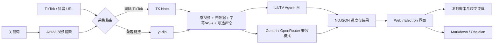

# ViralX

<p align="center">
  <strong>把爆款拆到每一秒。</strong><br>
  从原片、字幕和评论证据出发，解释钩子、镜头、声音与转化路径，再生成可以直接执行的复刻脚本。
</p>

<p align="center">
  <a href="https://viralx.metrolabs.mobi"></a>
  <a href="https://github.com/chongchonghaoman/ViralX/actions/workflows/ci.yml"></a>
  
  <a href="LICENSE"></a>
</p>

<p align="center">
  <a href="https://viralx.metrolabs.mobi">在线体验</a> ·
  <a href="https://viralx.metrolabs.mobi/settings.html">网页设置</a> ·
  <a href="DEPLOYMENT.md">部署记录</a> ·
  <a href="DESIGN.md">设计规范</a>
</p>


> [!IMPORTANT]
> 线上站点不是静态概念页：它已经接入 EdgeOne Python Cloud Functions，提供真实的同源分析 API。实际调用 LibTV、RapidAPI API23、MiniMax、Gemini 或 OpenRouter 前，仍需由使用者在设置页临时提供凭据，或由部署者配置项目环境变量。ViralX 不会把“页面在线”伪装成“外部分析服务已就绪”。

## 2026-08-25 重点更新

这次更新把 ViralX 从以本地 Flask / Electron 为主的分析工具，升级成了拥有正式网站、云端受限运行时和本地完整版的双运行时产品。

| 更新方向 | 现在的 ViralX |
| --- | --- |
| 网站重画 | 首页与设置页统一为亮色产品编辑风格；重新设计浮动导航、主视觉、分析工作台、证据章节、流程章节和页脚索引 |
| 设计系统 | 新增共享颜色、字体、间距、圆角与状态 token；中文使用 Noto Sans SC 回退，界面在桌面与移动端保持同一任务顺序 |
| 动效系统 | 使用 GSAP 3.13 与 ScrollTrigger 编排首屏、滚动章节、证据轨道和真实分析结果；完整支持 `prefers-reduced-motion` 降级 |
| 网页端能力 | 新增 EdgeOne Pages + Python Cloud Functions，在线提供 `health`、`keywords`、`analyze`、`generate_variants` 与浏览器版 Obsidian 导出 |
| 安全设置页 | 新增 `/settings.html` BYOK 页面；凭据仅保存在当前标签页 `sessionStorage`，经同源 HTTPS 临时发送，关页即清除 |
| API23 搜索 | 关键词发现改接 RapidAPI TikTok API23：请求使用 `/api/search/video` 的 `keyword`、`cursor`、`search_id`，并兼容 `item_list` / `itemList` 响应后统一归一化 |
| 采集与拉片 | 国际 TikTok 走 TK Note 资产优先流程；抖音等兼容链接保留 yt-dlp；LibTV 成为默认的一键上传、会话创建和增量轮询分析器 |
| 正式部署 | 上线 [viralx.metrolabs.mobi](https://viralx.metrolabs.mobi)，配置 DNSPod CNAME、EdgeOne 免费证书、自动续期与强制 HTTPS |
| 可靠性 | 新增 API23、云函数、公私路由、视频采集和 LibTV 工作流测试；当前共 23 项单元测试，CI 覆盖 Python 3.10、3.11、3.12 |

相关实现集中在 `static/`、`templates/`、`cloud-functions/`、`video_ingest.py`、`libtv_analyzer.py` 和 `scripts/build-edgeone.mjs`。完整视觉约束见 [DESIGN.md](DESIGN.md)，线上部署与运行边界见 [DEPLOYMENT.md](DEPLOYMENT.md)。

## 产品工作流

1. 输入关键词时，API23 负责发现候选 TikTok 视频；也可以直接粘贴 TikTok / 抖音单条视频链接跳过搜索。
2. ViralX 通过 TK Note / yt-dlp 下载原视频与安全元数据，优先读取字幕，必要时运行本地 ASR。
3. 同一份原视频资产被交给 LibTV，创建拉片会话并持续返回真实进度。
4. 前端按 NDJSON 流展示证据、结构、镜头与分析结果。
5. 使用 MiniMax 等模型生成不同角度的裂变脚本，并导出 Markdown / Obsidian。



## 在线版与本地版

ViralX 保留两套明确分工的运行时。网页端适合随开随用和单视频分析；本地 Flask 版拥有文件系统、持久缓存与长任务能力。

| 能力 | EdgeOne 在线版 | 本地 Flask 版 |
| --- | --- | --- |
| 首页、设置页、响应式界面 | 支持 | 支持 |
| 单视频分析 | 支持，每次请求最多 1 条 | 支持 |
| 批量与长时间任务 | 受 120 秒 / 6MB 云函数边界限制 | 支持 |
| LibTV / 模型凭据 | 当前标签页 BYOK 或项目环境变量 | `config.json` 或环境变量 |
| 视频、字幕和分析缓存 | 仅使用临时 `/tmp` 资产 | 持久写入本地目录 |
| 浏览器 Cookie、代理和评论采集 | 不承诺可用 | 可按本地环境配置 |
| Obsidian 导出 | Obsidian URI 或 Markdown 下载 | 可直接写入本地 Vault |
| 设置持久化、缓存清理 | 不公开相关 API | 支持 |

### 在线使用

1. 打开 [viralx.metrolabs.mobi](https://viralx.metrolabs.mobi)。
2. 进入 [设置页](https://viralx.metrolabs.mobi/settings.html)，填写本次标签页需要使用的 LibTV、API23 搜索或模型凭据。
3. 返回分析页，输入关键词或视频链接并开始拉片。

页面无需凭据即可浏览；真实外部分析需要对应服务的 Key。`/api/health` 只报告运行时和凭据就绪状态，不代表第三方服务已经成功调用或计费。

## 本地快速开始

环境要求：Python 3.10+。Electron 桌面端和 EdgeOne 构建还需要 Node.js 18+。

### 1. 安装依赖

```bash
python -m pip install -r requirements.txt
npm install
```

### 2. 创建本地配置

macOS / Linux：

```bash
cp config.json.example config.json
```

Windows PowerShell：

```powershell
Copy-Item config.json.example config.json
```

最小可用配置：

```json
{
  "analysis_mode": "libtv",
  "libtv_access_key": "YOUR_LIBTV_ACCESS_KEY",
  "rapidapi_key": "YOUR_API23_RAPIDAPI_KEY",
  "minimax_api_key": "YOUR_MINIMAX_API_KEY"
}
```

完整字段、默认模型、超时、并发、TK Note、ASR、Cookie 与代理配置见 [`config.json.example`](config.json.example)。也可以通过环境变量提供敏感值，例如：

```bash
export LIBTV_ACCESS_KEY="your-access-key"
```

Windows PowerShell：

```powershell
$env:LIBTV_ACCESS_KEY = "your-access-key"
```

常用服务：

- [LibTV](https://www.liblib.tv/)：默认拉片分析器。
- [RapidAPI TikTok API23](https://rapidapi.com/Lundehund/api/tiktok-api23)：只负责关键词搜索和候选视频发现；ViralX 使用 `/api/search/video` 并将嵌套响应归一化为稳定字段。
- [MiniMax](https://www.minimaxi.com/)：复刻脚本与裂变变体。
- [OpenRouter](https://openrouter.ai/) / Gemini：兼容分析模式。

直接粘贴 TikTok 视频链接时会跳过 API23，由 TK Note 处理视频、安全元数据、字幕与本地 ASR，因此这条主链不依赖 RapidAPI。若需要可选评论采集：

```bash
python -m pip install -r requirements-tk-comments.txt
playwright install chromium
```

TikTok 评论依赖私有 Web 接口，可能还需要用户自己的 `TIKTOK_MS_TOKEN`、浏览器会话或代理。评论失败只会标记可选阶段受阻，不会阻止原视频继续进入 LibTV。

### 3. 启动

本地 Web：

```bash
python web_app.py
```

访问 `http://localhost:5001`。

Electron 桌面端：

```bash
npm start
```

## EdgeOne 构建与部署

```bash
npm run build:edgeone
npm run preview:edgeone
npm run deploy:edgeone
```

`deploy:edgeone` 默认部署到绑定 `viralx.metrolabs.mobi` 的 `viralx-overseas` 生产项目。`public/` 是构建产物并已忽略；构建脚本只复制公网安全入口、必要后端模块和前端资产，不会复制 `config.json`。

## API

| 端点 | 方法 | EdgeOne | 本地 Flask | 说明 |
| --- | --- | --- | --- | --- |
| `/` | GET | 是 | 是 | 主界面 |
| `/settings.html` | GET | 是 | 构建产物 | 当前标签页 BYOK 设置页 |
| `/settings` | GET | 否 | 是 | 本地持久化设置页 |
| `/api/health` | GET | 是 | 是 | 返回不含密钥值的运行状态 |
| `/api/keywords` | GET | 是 | 是 | 获取可用关键词或缓存记录 |
| `/api/analyze` | POST | 是 | 是 | NDJSON 流式视频分析 |
| `/api/generate_variants` | POST | 是 | 是 | 生成裂变脚本变体 |
| `/api/export-obsidian` | POST | 是 | 是 | 在线版下载/URI；本地版可写文件系统 |
| `/api/settings` | GET / POST | 否 | 是 | 本地设置读写 |
| `/api/cache/clear` | POST | 否 | 是 | 本地分析缓存清理 |

## 设计与动效

- 视觉方向：受 Butter 产品叙事节奏启发的亮色产品编辑界面；保留 ViralX 自有内容、主视觉和分析工作流。
- 主视觉：`static/assets/viralx-signal-orbit.png`，用视频画面、播放镜片、波形与时间线表达“证据拆解”。
- 字体：Hanken Grotesk + Noto Sans SC，不复制或热链商业字体文件。
- 动效：GSAP + ScrollTrigger；分析进度和结果动效绑定真实状态，不使用无意义循环漂浮。
- 无障碍：键盘焦点、禁用态、错误恢复信息、移动端任务顺序和减弱动效偏好均有对应处理。

设计 token 与交互边界以 [DESIGN.md](DESIGN.md) 和 `static/tokens.css` 为准。

## 安全与运行边界

- 不提交 `config.json`、API Key、EdgeOne 访问令牌或临时预览链接。
- EdgeOne BYOK 凭据只保存在当前标签页 `sessionStorage`，只随同源 HTTPS 请求发送，关闭标签页后清除。
- 健康检查只返回布尔就绪信息，不回显任何凭据值。
- 云函数每次最多处理 1 条视频，临时文件写入 `/tmp`，并遵守 EdgeOne 的执行时长与响应大小限制。
- 在线版不公开设置读取与缓存清理接口，也不声称拥有本地 Cookie、任意代理、持久缓存或 Obsidian 文件系统权限。
- 本地版继续负责持久设置、视频缓存、长任务、评论采集和直接 Obsidian 写入。

## 项目结构

```text
ViralX/
├── .agents/skills/
│   ├── libtv-skill/            # LibTV 上传、会话与结果脚本
│   └── tk-note/                # 国际 TikTok 采集与证据工作流
├── cloud-functions/
│   ├── api/[[default]].py      # EdgeOne 公网安全 API
│   └── requirements.txt
├── scripts/build-edgeone.mjs   # EdgeOne 构建脚本
├── static/
│   ├── assets/                 # ViralX 主视觉
│   ├── tokens.css              # 共享设计 token
│   ├── viralx.css / viralx.js  # 首页、报告与 GSAP 交互
│   └── settings.css / settings.js
├── templates/
│   ├── index.html              # 分析首页
│   └── settings.html           # 设置页
├── tests/                      # 采集、LibTV、Flask 与云函数测试
├── ai_analyzer.py              # 统一分析编排
├── video_ingest.py             # TK Note / yt-dlp 路由
├── libtv_analyzer.py           # LibTV 适配器
├── web_app.py                  # 本地 Flask 服务
├── main.js                     # Electron 入口
├── DESIGN.md                   # 视觉和交互契约
├── DEPLOYMENT.md               # 线上项目、DNS、HTTPS 与运行边界
├── edgeone.json
└── package.json
```

## 验证

运行完整单元测试：

```bash
python -m unittest discover -s tests -v
```

当前测试集共 23 项，覆盖：

- TK Note 采集路由、进度合同与资产复用；
- LibTV 上传、会话轮询、超时和失败保护；
- Flask 页面、健康检查和直接链接分析；
- EdgeOne BYOK、公私路由边界与浏览器版 Obsidian 导出。
- API23 请求参数、`item_list` / `itemList` 响应归一化、热度过滤与错误映射。

验证 EdgeOne 构建：

```bash
npm run build:edgeone
```

GitHub Actions 会在 `main` 推送和 Pull Request 时，使用 Python 3.10、3.11、3.12 运行编译检查与测试。

## License

[MIT](LICENSE)。第三方组件和相关许可见 [THIRD_PARTY_NOTICES.md](THIRD_PARTY_NOTICES.md)。
